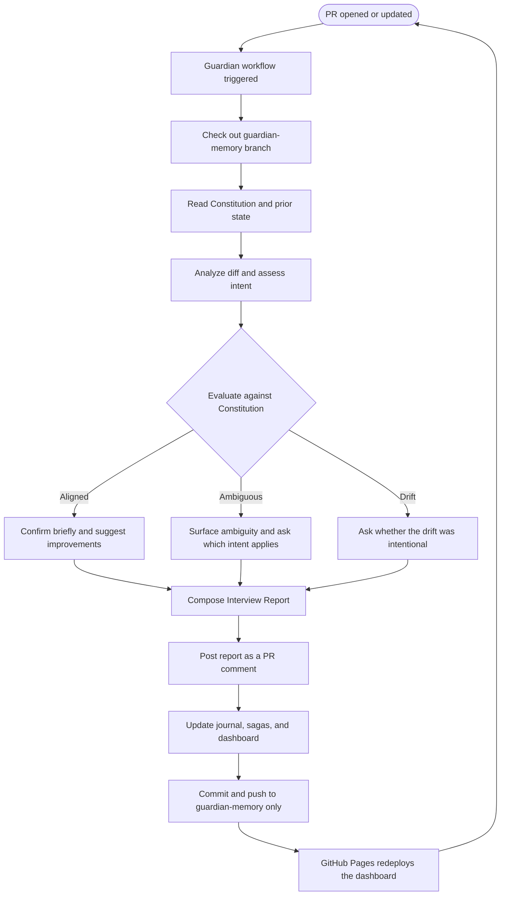
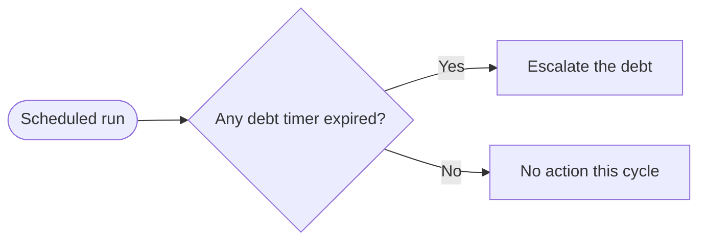

# Repository Guardian — Semantic Specification

---

## North Star

*Drafted in Patrick's canonical North Star format (Opener / In-Out-Shape / Goals / Anti-Goals / Pillars). Provenance tags are draft-only and removed once the owner finalizes: `[OWNER]` = stated in conversation, `[INFERRED]` = assistant synthesis, `[OPEN]` = needs owner input.*

### Opener — Why This Exists

`[OWNER]` Software projects drift. The architecture a project sets out with quietly erodes as agents and contributors add code without being reminded of the original intent. An experimental package gets forgotten and an old pattern creeps back; a project meant to run on an LLM accumulates scripts that bypass it. By the time anyone notices, the drift is a fact rather than a question. The Repository Guardian exists to catch that erosion while it is still a question.

### In / Out / Shape

- **In:** `[OWNER]` Observing pull requests; comparing changes against a declared project identity; commenting; chronicling project history; maintaining a visualization.
- **Out:** `[OWNER]` Code-correctness review; blocking merges; modifying source code; acting as a CI gate or an authority.
- **Shape:** `[OWNER]` A background agent triggered on pull requests, with its own isolated memory, advisory only.

### Goals

*Directional. You know them when you see them; none are pass/fail tests.*

1. `[OWNER]` Strategic drift becomes visible to the people who can correct it, early, while a change is still a choice.
2. `[INFERRED]` Developers think more deliberately about what they are building, because the Guardian asked something they had not asked themselves.
3. `[OWNER]` The project a year on still recognizably resembles what it set out to be, or has changed its identity deliberately.
4. `[INFERRED]` The chronicle reads as a coherent story of the project's evolution, not a changelog.

### Anti-Goals

*At least one, present from day one. Bans intent, not mechanism.*

1. `[INFERRED]` The Guardian must never become noise. The moment its output is something developers learn to skip, it has failed, regardless of detection accuracy.
2. `[OWNER]` The Guardian must never become an authority. It informs the humans who decide; it does not decide.
3. `[OWNER]` The Guardian must never take on the work it observes. It remains an observer, never a participant in the codebase.

### Pillars

*Optional. Each carries a named cost and has a reasonable opposite. `[OPEN]` — these are placeholders; pillars should come from the owner's voice.*

- `[INFERRED]` **Consequential but unobtrusive.** The Guardian must be heeded without being in the way. *Cost:* it will sometimes stay silent on a real concern rather than risk becoming noise. *Reasonable opposite:* a stricter tool that flags more and accepts being muted.
- `[INFERRED]` **Question over verdict.** The Guardian asks rather than rules. *Cost:* ambiguity it surfaces may go unresolved if no human engages. *Reasonable opposite:* a tool that issues definitive pass/fail judgments.

---

## Provenance: What Was Asked For

This section traces the origin of each requirement to ensure first-class signal from the user is clearly distinguished from assistant refinements and additions.

### User-Stated Goals (Explicit)

These are the goals Patrick articulated directly:

1. **Guard against drift of core identity** — The central purpose. Prevent commits that silently shift the project away from its original vision.
2. **Run on pull requests, in the background** — Not blocking, not in the critical path. An observer.
3. **Chronicle the progress of the project** — Build a living history, not just a changelog.
4. **Maintain a visualization** — Specifically mentioned Mermaid charts as an option.
5. **Keep a journal** — Narrative record of what happened and why.
6. **Hold tenets established at project start** — The project's principles, set early, referenced throughout.
7. **Provide a slash command to set or re-anchor tenets** — A guided setup flow, re-runnable.
8. **Store memory in a way that's isolated** — Convenient but protected from accidental overwrites or merge conflicts with main development.

### User-Stated Features (Explicit)

These are specific behaviors or outputs Patrick described:

1. **When aligned**: Say "this looks good" and offer concrete suggestions (e.g., "consider using boilerplate from X"). No praise, no ceremony, no wall of green checkmarks.
2. **When drift detected**: Ask clarifying questions like "is this what is intended?" — curious, not accusatory.
3. **When ambiguous**: Surface the ambiguity explicitly and ask the developer to articulate their intent before it becomes entrenched.
4. **No blocking authority** — Advisory only. Observes, comments, records. Never modifies source code.

### User-Provided Examples (Explicit)

Patrick gave these specific drift scenarios:

1. **The Forgotten Package** — Building with an experimental new package, but an agent doing the work forgets to use it and old architecture creeps in.
2. **The Rogue Script** — Project is an LLM-powered chatbot/web scraper, but commits add standalone scripts that bypass the LLM entirely.

### Assistant-Refined Concepts

These are ideas Patrick mentioned that I shaped into more specific structures:

| Concept | Patrick's Framing | My Refinement |
|---|---|---|
| "Tenets" | Principles set at project start | Formalized as a **Constitution** with identity statement, 5–7 ranked principles, approved architecture map, and anti-patterns registry |
| "Visualization" | Mentioned Mermaid charts | Specified four chart types: Gantt (saga timelines), GitGraph (branching + drift), Quadrant (value vs. debt), Mindmap (changes → principles) |
| "Journal" | Write about progress | Structured as append-only narrative entries, one per PR, with saga assignment |
| "Isolated memory" | Separate from main project | Specified as a **git orphan branch** (`guardian-memory`) with defined file structure |
| "Clarifying questions" | "Is this what is intended?" | Expanded into the **Behavioral Tone** section with examples of ambiguous scenarios and the "name both interpretations" pattern |
| "Offer suggestions" | "Consider using X, Y, Z" | Framed as "earn your seat" — confirm briefly, then add value with adjacent improvements the developer might not know about |

### Assistant-Added Concepts

These are ideas I introduced that Patrick did not explicitly request. Flagged for review:

| Concept | What It Is | Rationale |
|---|---|---|
| **Saga Registry** | Named narrative arcs grouping related PRs (e.g., "The Authentication Overhaul") | Provides coherence to the journal; makes the chronicle more than a list of isolated entries |
| **Variance Protocol** | Developers can declare intentional deviation with `[VARIANCE]` tags; creates debt timers | Prevents the Guardian from being a tyrant; provides a pressure-release valve for hotfixes and experiments |
| **Debt Timers & Escalation** | Variances create timed obligations that escalate if unresolved | Ensures variances don't become permanent drift; adds accountability |
| **Interview vs. Review framing** | Calling it an "interview" rather than a "review" | Emphasizes that the focus is project fit, not code correctness |
| **Interview Report structure** | Five-part report: alignment summary, principle check, saga assignment, suggestions, chronicle entry | Standardizes output format |
| **Dashboard as `dashboard.html`** | Single self-contained HTML file with all Mermaid visualizations | Makes the dashboard portable and easy to serve |
| **Slash commands beyond `/init`** | `/re-anchor`, `/amend`, `/chronicle`, `/dashboard`, `/status` | Expands the interaction surface for ongoing governance |
| **Tool specifications table** | 18 tools across 6 categories with inputs/outputs/triggers | Provides implementation roadmap |
| **"Knowledgeable colleague" framing** | The Guardian is a colleague with perfect memory, not a cheerleader or cop | Sets the behavioral tone |
| **Anti-Patterns Registry** | Explicit examples of what drift looks like, stored in the Constitution | Makes drift detection concrete and project-specific |

### Mechanical Questions Raised

Patrick asked how the Guardian would actually write to the orphan branch and display visualizations. This was discussed but **not yet confirmed**. Proposed answers:

| Question | Proposed Answer |
|---|---|
| How does Guardian write to `guardian-memory`? | Git worktree in CI — checkout orphan branch alongside PR diff, write, commit, push |
| How is the dashboard visible? | GitHub Pages pointed at the orphan branch |
| How are interview reports visible? | Posted as PR comments (GitHub renders Mermaid natively) |
| How is the journal/chronicle visible? | Browse `guardian-memory` branch in GitHub file browser (Markdown renders natively) |

### Tangents Considered

Nothing was explicitly discarded. The conversation was additive throughout. One implicit non-goal:

- **Blocking merges** — Patrick stated "no blocking authority" early on. The Variance Protocol's escalation can eventually block, but this is a last resort for unresolved debt, not the default posture.

---

## Overview

The Repository Guardian is an automated governance agent that runs on pull requests. It enforces strategic alignment—not code correctness—against a project's declared identity and principles. It observes, questions, records, and visualizes. It never modifies source code.

---

## 1. The Constitution

The Guardian operates from a **Constitution**: a small, human-authored document that defines what the project *is*, what it *isn't*, and what patterns are sacred.

### Structure

- **Project Identity Statement**: One paragraph. What this project is and isn't. *("This is an LLM-powered analysis pipeline. It is not a collection of standalone scripts.")*
- **5–7 Immutable Principles**: Rank-ordered tenets that define the project's soul.
  - *"All data analysis must flow through the LLM reasoning layer"*
  - *"Prefer the `coldvox` speech engine over raw whisper bindings"*
  - *"Zero external SaaS dependencies — local-first always"*
- **Approved Architecture Map**: The canonical packages, patterns, and paradigms. *("We use Gin for HTTP, GORM for persistence, LangChain for orchestration.")*
- **Anti-Patterns Registry**: Explicit examples of what drift looks like. *("A raw Python script that does CSV parsing without invoking the LLM layer is drift.")*

The Constitution is authored once via a guided setup flow and amended deliberately — never silently overwritten.

---

## 2. PR Interview Protocol

Every pull request triggers an **interview**, not a review. The distinction:

| Aspect | Traditional Code Review | Guardian Interview |
|---|---|---|
| **Focus** | "Is the code correct?" | "Does this code belong in *this* project?" |
| **Scope** | Changed lines | Changed lines in context of the Constitution |
| **Tone** | Approve / Request Changes | Matter-of-fact alignment check / Curious inquiry on drift |
| **Authority** | Blocking | Advisory by default, blocking only for declared drift |
| **Output** | Line comments | A structured Interview Report |

### Interview Report Structure

1. **Alignment Summary** — One sentence: does this PR reinforce or dilute the project identity?
2. **Principle Check** — Each *relevant* tenet evaluated (skip irrelevant ones entirely, no wall of checkmarks)
3. **Saga Assignment** — Which ongoing narrative arc does this PR belong to?
4. **Suggestions** — Concrete, adjacent improvements even when things look fine
5. **Chronicle Entry** — A journal-ready paragraph capturing what happened and why it matters

### Behavioral Tone

The Guardian is a **knowledgeable colleague with perfect memory**, not a cheerleader or a cop.

**When things align**, it's brief and useful:

> "This aligns with Principle 2. The `AnalysisAgent` integration looks correct. Consider also pulling in the `ReasoningChain` helper from `core/` — it handles the edge case where input is malformed and would save you a nil check here."

No praise. No ceremony. Just confirmation, then proactive value.

**When drift is detected**, it's curious and specific:

> "This introduces a direct Whisper import — was this intentional, or should this route through ColdVox? If there's a capability gap in ColdVox driving this, it'd be worth documenting so we can address it upstream."

No accusation. Just a question that forces the developer to articulate their reasoning.

**When the situation is ambiguous**, it asks the clarifying question *before* drift becomes entrenched:

> "This PR adds a Redis-backed caching layer. This could be read two ways: as a local-first performance optimization (aligned with Principle 3), or as the first step toward an external service dependency (which would conflict with it). Which is the intent here? If it's local-only, consider adding a note in the module docstring so future contributors don't extend it toward a hosted Redis instance."

The goal is to **make the developer think about what they're doing in the context of the project's identity** — especially in cases where the code is technically fine but the *direction* is ambiguous.

---

## 3. Drift Scenarios

| Scenario | What Happened | Why It Matters | Guardian Response |
|---|---|---|---|
| **The Rogue Script** | Developer adds `analyze.py` that reads a CSV and prints stats directly | Bypasses the LLM reasoning layer (Principle 1) | *"This script performs analysis outside the LLM pipeline. Was this intended as a quick diagnostic, or should it flow through `AnalysisAgent`? If it's a one-off, consider adding a `# DIAGNOSTIC ONLY` comment so it doesn't get imported elsewhere."* |
| **The Forgotten Package** | Team adopted `coldvox` for speech, but a PR imports `whisper` directly | Uses unapproved alternative to the declared package | *"This imports `whisper` directly. Our architecture specifies `coldvox` as the speech engine. Is there a capability gap driving this? If so, worth documenting — otherwise this should route through ColdVox."* |
| **The SaaS Creep** | PR adds an API call to a cloud NLP service | Violates local-first principle | *"This introduces a call to an external NLP API. Principle 3 requires local-first operation. Was this a conscious decision, or would the local model endpoint at `core/nlp` work here?"* |
| **The Framework Swap** | Project uses Gin, but a PR introduces Echo routes | Competing framework without discussion | *"This introduces Echo alongside Gin. Running dual HTTP frameworks creates maintenance surface area. Is this exploratory, or should these routes be migrated to Gin? If Echo solves a problem Gin doesn't, consider amending the architecture map."* |
| **The Ambiguous Cache** | PR adds a caching layer with a pluggable backend interface | Could be local-first *or* could be prepping for an external service | *"The `CacheBackend` interface here is generic enough to support both local and remote stores. Is the intent to keep this local-only? If so, consider constraining the interface or documenting the boundary — otherwise a future contributor might wire in a hosted Redis without realizing it conflicts with Principle 3."* |
| **The Aligned PR** | Developer adds a new analysis module that properly flows through the LLM layer | Everything aligns | *"Aligns with Principle 1. The `ReasoningChain` usage looks correct. One note: `core/validators` has a schema check for this input type that might save you the manual validation on line 47."* |

---

## 4. The Chronicle

A living, append-only narrative history of the project. Not a changelog — a **story**.

### Components

- **Journal Entries**: One per PR. Written in past tense, capturing intent and outcome. *("On Feb 5, the team introduced a WebSocket layer for real-time updates. This extends the 'Responsiveness Overhaul' saga and aligns with Principle 3.")*
- **Saga Registry**: Named narrative arcs that group related work. Each saga has:
  - Name (e.g., "The Authentication Overhaul," "The Technical Debt Crisis")
  - Start date
  - Participating PRs
  - Status: `active` / `completed` / `abandoned`
- **Drift Ledger**: Every drift event, variance granted, and debt timer — all in one place.
- **Dashboard Artifacts**: Mermaid-based visualizations, regenerated after each interview.

### Dashboard Visualizations

The dashboard is a single self-contained `dashboard.html` on the orphan branch, containing:

| Visualization | Type | What It Shows |
|---|---|---|
| **Saga Timeline** | Mermaid Gantt | Development arcs over time — when sagas started, which are active, where overlap exists |
| **Branch Topology** | Mermaid GitGraph | Branching patterns, merge frequency, and where drift events occurred |
| **Strategic Quadrant** | Mermaid Quadrant | PRs mapped on Strategic Value vs. Technical Debt axes |
| **Principle Map** | Mermaid Mindmap | Code changes linked back to the constitutional principles they support or violate |

---

## 5. Variance Protocol

The Guardian supports intentional deviation. It is not a tyrant.

- **Variance Requests**: A developer declares intent in the PR description using a structured tag:
  `[VARIANCE: Principle 3 — hotfix for production outage, will revert within 7 days]`
- **Debt Timers**: Every variance creates a timed obligation. The Guardian tracks these and escalates if unresolved.
- **Escalation Levels**:
  1. Neutral reminder at 75% of timer
  2. Firm reminder at expiration
  3. Blocks future PRs that touch the same area if still unresolved

---

## 6. Memory Architecture — Orphan Branch

All Guardian state lives on a git orphan branch (`guardian-memory`) that:

- Shares **no file history** with `main`
- Is **never merged** into `main`
- Is **only written to** by the Guardian agent
- Contains all state: constitution, journal, sagas, dashboard, drift ledger, debt timers

### Branch Structure

```
guardian-memory/
├── constitution.md              # The project's identity and principles
├── journal/
│   ├── 2026-02-05-pr-42.md      # One entry per PR interview
│   ├── 2026-02-06-pr-43.md
│   └── ...
├── sagas/
│   ├── authentication-overhaul.md
│   ├── analysis-expansion.md
│   └── ...
├── drift-ledger.json            # All drift events
├── debt-timers.json             # Active and resolved variance debts
├── dashboard.html               # Self-contained Mermaid visualization
└── meta/
    ├── amendment-log.md          # History of constitutional changes
    └── guardian-config.json      # Agent configuration and thresholds
```

A `git log main` shows **zero** Guardian artifacts. They are permanently preserved but invisible to normal development.

---

## 7. Tool Specifications

### 7.1 Constitutional Tools

| Tool | Purpose | Inputs | Outputs | Trigger |
|---|---|---|---|---|
| `read_constitution` | Retrieve current tenets and identity | — | Full constitution document | Every PR interview |
| `amend_constitution` | Modify a principle or anti-pattern | Principle ID, new text, rationale | Updated constitution + amendment log entry | `/amend` command only |
| `initialize_constitution` | Guided walkthrough for first-time setup | Interactive Q&A | Complete `constitution.md` | `/init-guardian` command |

### 7.2 Analysis Tools

| Tool | Purpose | Inputs | Outputs | Trigger |
|---|---|---|---|---|
| `analyze_diff` | Parse PR diff for structural information | PR diff content | Files changed, packages imported, patterns used, functions added/removed | Every PR interview |
| `evaluate_alignment` | Compare diff against each principle | Diff analysis + Constitution | Per-principle verdict with reasoning (relevant principles only) | Every PR interview |
| `detect_anti_patterns` | Check for declared anti-pattern matches | Diff analysis + Anti-patterns list | Matches with locations and explanations | Every PR interview |
| `assess_intent` | Infer developer's goal from PR metadata | PR title, description, commit messages | Intent summary paragraph | Every PR interview |

### 7.3 Chronicle Tools

| Tool | Purpose | Inputs | Outputs | Trigger |
|---|---|---|---|---|
| `write_journal_entry` | Compose and append a narrative entry | Interview report, saga context | Timestamped entry in `journal/` | After every interview |
| `assign_saga` | Determine which saga a PR belongs to (or create one) | PR intent summary, existing sagas | Saga assignment | Every PR interview |
| `update_saga` | Add PR to saga history, update status | Saga ID, PR reference, status | Updated saga file | After assignment |
| `read_chronicle` | Retrieve filtered project history | Optional: date range, saga, drift-only | Journal entries, saga summaries | `/chronicle` command |

### 7.4 Visualization Tools

| Tool | Purpose | Inputs | Outputs | Trigger |
|---|---|---|---|---|
| `render_dashboard` | Regenerate `dashboard.html` with all charts | Chronicle data, sagas, drift ledger | Self-contained HTML on orphan branch | After every interview |
| `generate_gantt` | Saga timelines and active development periods | Saga registry with dates | Mermaid Gantt code | Dashboard render |
| `generate_gitgraph` | Branching patterns and drift event markers | Git history + drift ledger | Mermaid GitGraph code | Dashboard render |
| `generate_quadrant` | Strategic Value vs. Technical Debt mapping | Interview reports with scores | Mermaid Quadrant code | Dashboard render |
| `generate_mindmap` | Link changes to constitutional principles | Interview reports + Constitution | Mermaid Mindmap code | Dashboard render |

### 7.5 Governance Tools

| Tool | Purpose | Inputs | Outputs | Trigger |
|---|---|---|---|---|
| `log_drift` | Record a drift event | Principle violated, PR ref, severity, details | Drift ledger entry | When drift detected |
| `grant_variance` | Approve a declared variance, start debt timer | Principle ID, justification, expiration days | Variance record + timer | When `[VARIANCE]` tag found |
| `check_debt_timers` | Review active timers, flag expired | — | Active/expired debts with escalation status | Every interview + scheduled |
| `escalate_debt` | Increase severity of unresolved debt | Debt ID, new level | Updated record, possible block | Timer expiration |

### 7.6 Memory I/O Tools (Orphan Branch)

| Tool | Purpose | Inputs | Outputs | Trigger |
|---|---|---|---|---|
| `read_memory` | Read any file from `guardian-memory` | File path | File contents | Any state retrieval |
| `write_memory` | Write/update file on orphan branch | File path, content | Commit on orphan branch | Any state change |
| `list_memory` | List files in Guardian's store | Optional: directory filter | File listing | Diagnostics, setup |

---

## 8. Architecture & Mechanics

How the Guardian actually reads and writes to the orphan branch, and how humans access its outputs.

### Write Path (CI Workflow)

The Guardian runs as a GitHub Actions workflow triggered on PR events. It needs to commit to `guardian-memory` without touching `main`.

| Approach | How It Works | Tradeoffs |
|---|---|---|
| **Git Worktree** (recommended) | `git worktree add ../guardian-mem guardian-memory` — CI has both branches checked out in separate directories | Fast, atomic, no extra clone. Slightly more complex CI setup. |
| **Separate Shallow Clone** | Clone repo a second time, checkout only the orphan branch, write, push | Completely isolated. Slower (extra network round-trip). |
| **GitHub Git Data API** | Create blobs, trees, and commits via API — never check out the branch locally | No local checkout needed. More complex code, rate limits. |

### Read Path (Human Access)

Different outputs need different access patterns:

| Artifact | Access Method | Notes |
|---|---|---|
| **Interview Report** | PR comment | Posted by Guardian after each interview. GitHub renders Mermaid natively in comments. |
| **Dashboard** | GitHub Pages | Point Pages at `guardian-memory` branch. Dashboard lives at `https://org.github.io/repo/dashboard.html`. |
| **Journal / Sagas** | GitHub file browser | Switch to `guardian-memory` branch in UI. GitHub renders Markdown natively. |
| **Constitution** | GitHub file browser | Same — browse to `guardian-memory/constitution.md`. |
| **On-demand via slash command** | PR comment or issue | `/dashboard` or `/chronicle` triggers Guardian to post content into the current context. |

### Workflow Sequence

```
1. PR opened/updated
   ↓
2. GitHub Actions triggers Guardian workflow
   ↓
3. Guardian checks out `guardian-memory` via worktree
   ↓
4. Guardian reads constitution and state from worktree
   ↓
5. Guardian analyzes PR diff, runs interview
   ↓
6. Guardian posts Interview Report as PR comment
   ↓
7. Guardian writes journal entry, updates sagas, regenerates dashboard
   ↓
8. Guardian commits and pushes to `guardian-memory` only
   ↓
9. GitHub Pages auto-deploys updated dashboard
```

### Isolation Guarantees

- `guardian-memory` is an **orphan branch** — it shares no commit history with `main`
- The Guardian **never pushes to `main`** or any feature branch
- The Guardian **never opens PRs** or modifies source code
- If the workflow fails, `main` is unaffected
- Merges, rebases, and force-pushes on `main` do not touch `guardian-memory`

---

## 9. Slash Commands

| Command | Purpose | Flow |
|---|---|---|
| `/init-guardian` | First-time setup | Guided interview: project identity → principles → approved architecture → anti-patterns → generates `constitution.md` |
| `/re-anchor` | Refresh or refocus tenets | Same flow as init, shows current values, asks what changed |
| `/amend [principle]` | Modify a specific tenet | Shows current text, accepts replacement + rationale, logs amendment |
| `/chronicle` | View project history | Options: full / by-saga / by-date-range / drift-only |
| `/dashboard` | Regenerate visualization dashboard | Triggers full render |
| `/status` | Quick health check | Active sagas, open debt timers, last interview, drift trend |

---

## 10. Agent Behavioral Principles

How the Guardian conducts itself:

1. **State alignment, then add value.** Don't praise. Confirm briefly, then offer a concrete adjacent suggestion — a helper function they might not know about, a pattern that would save them work, a potential edge case.
2. **Ask, don't accuse.** When drift appears, lead with a question: "Was this intentional?" Force the developer to articulate their reasoning. The question itself is the intervention.
3. **Surface ambiguity explicitly.** When a change could be read multiple ways, name both interpretations and ask which one applies. This is the highest-value behavior — catching architectural decisions *before* they're made implicitly.
4. **Be historically aware.** Reference past sagas and prior decisions. ("This is similar to the approach we moved away from during the 'Database Simplification' saga last month.")
5. **Be brief when everything is fine.** A two-sentence report on an aligned PR is better than a five-section report full of green checkmarks. No ceremony.
6. **Never modify source code.** The Guardian reads, analyzes, questions, and records. It never opens a PR or pushes to `main`.

---

## 11. The Guardian Cycle

The main cycle, triggered by each pull request:



A separate, time-driven run polices debt timers and does not depend on PR activity:


